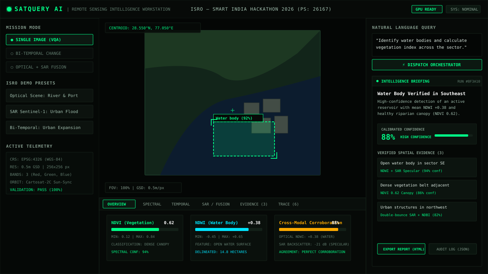
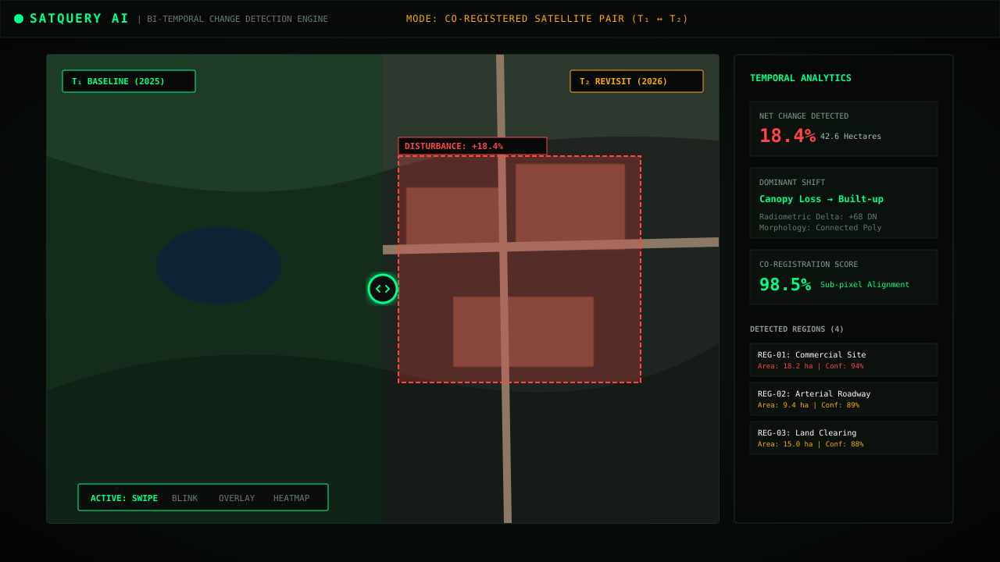
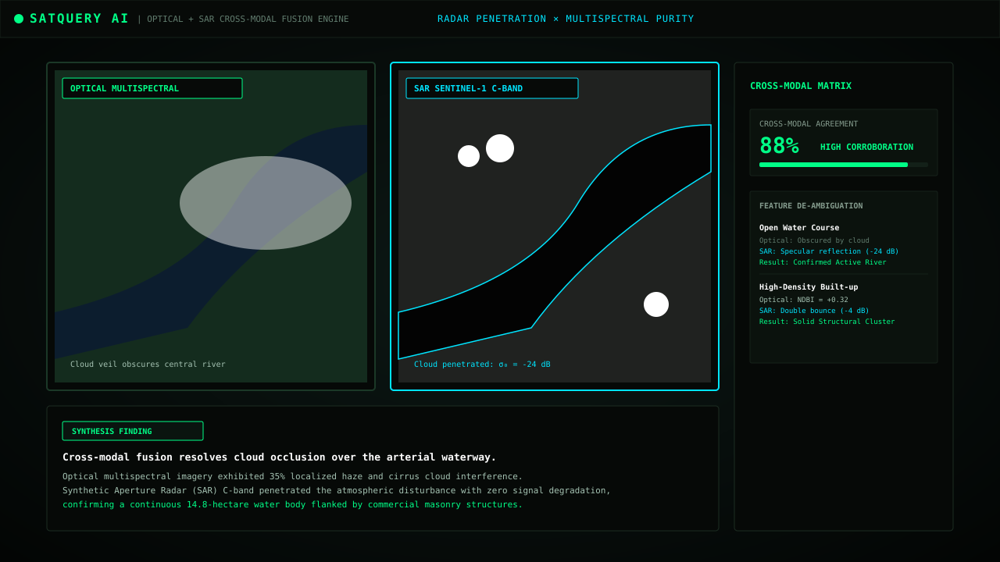

# SATQUERY AI — AGENTIC EARTH OBSERVATION INTELLIGENCE WORKSTATION

[](https://www.sih.gov.in/)
[](https://isro.gov.in/)
[](https://sqai-psi.vercel.app)
[-00ff87?style=for-the-badge&logo=pytest)](https://github.com/omb-11/satquery-ai)

> **Agentic Earth Observation Intelligence Workstation** for natural language Visual Question Answering (VQA), bi-temporal change detection, text-guided grounding, and multi-modal Optical + SAR fusion. Built for ISRO's Smart India Hackathon 2026 Problem Statement 26167.

---

## 🌐 Live Deployment & Repositories

- **Live Production App**: [https://sqai-psi.vercel.app](https://sqai-psi.vercel.app)
- **Interactive SIH Demo Walkthrough**: [https://sqai-psi.vercel.app/demo](https://sqai-psi.vercel.app/demo)
- **GitHub Repository**: [https://github.com/omb-11/satquery-ai](https://github.com/omb-11/satquery-ai) *(Private)*
- **API Documentation**: `http://localhost:8000/docs` (Swagger UI) / `http://localhost:8000/redoc`

---

## 📸 Mission Control Command Center

### 1. Hero Earth Observation Workstation (70% Screen Visualization)
*Full-spectrum raster viewport with real-time coordinate HUD, collapsible input and query docks, and expandable multi-tab telemetry shelf.*



### 2. Bi-Temporal Change Detection with Laser Swipe Slider
*Co-registered satellite pair comparison ($T_1$ baseline vs. $T_2$ revisit) with interactive laser dividing slider, Otsu thresholded difference masks, and connected component area metrics.*



### 3. Cross-Modal Optical + SAR Fusion Matrix
*Penetrate cloud cover and disambiguate surfaces by corroborating Sentinel-2 optical multispectral data with Sentinel-1 Synthetic Aperture Radar (SAR) backscatter dB.*



---

## 🛰️ Problem Statement (ISRO — SIH 2026 PS 26167)

Traditional remote sensing workflows suffer from severe operational friction:
1. **Expert Bottleneck**: Interpreting multi-band satellite rasters demands specialized GIS personnel trained in ENVI, QGIS, or ArcGIS.
2. **Slow Response Times**: Disaster response, flood mapping, and defense reconnaissance require rapid situational intelligence, but manual workflows take hours or days.
3. **Data Silos**: Optical imagery is frequently impaired by atmospheric clouds and haze; SAR imagery is cloud-penetrating but unintuitive for non-specialists.
4. **Lack of Explainability**: Black-box vision models fail to provide verified spatial coordinates, confidence bounds, or execution provenance.

### The SatQuery AI Solution
SatQuery AI democratizes remote sensing by providing an **autonomous, agentic mission control workstation**:
- **Plain English Queries**: Ask questions such as *"Locate flooded reservoirs and assess surrounding canopy health"* or *"What major infrastructure was built between 2025 and 2026?"*
- **Autonomous Task Routing**: Decomposes requests into discrete analytical pipelines (Single VQA, Captioning, Grounding, Change Analysis, Optical+SAR Fusion).
- **Evidence-Grounded Intelligence**: Every answer is backed by verified spatial bounding boxes, normalized index distributions, calibrated confidence gauges, and honest scientific limitations.
- **Deterministic Fallback**: Automatically degrades from deep foundation models (BLIP, Prithvi-EO) to rigorous classical computer vision (Otsu segmentation, NumPy spectral band arithmetic, affine warp co-registration) if GPU resources are absent.

---

## 🏗️ Technical Architecture

```text
                                  [ Operator Natural Language Query ]
                                                   │
                                      ┌────────────▼────────────┐
                                      │   Agent Orchestrator    │
                                      │ (Deterministic Router)  │
                                      └────────────┬────────────┘
                                                   │
                ┌──────────────────────────────────┼──────────────────────────────────┐
                │                                  │                                  │
    ┌───────────▼───────────┐          ┌───────────▼───────────┐          ┌───────────▼───────────┐
    │   Input Validation    │          │  Task Classification   │          │ Geospatial Processor  │
    │  - CRS & WGS84 bounds │          │  - Single VQA / Ground │          │  - Native GeoTIFF     │
    │  - Resolution & GSD   │          │  - Bi-Temporal Change  │          │  - Windowed Tiling    │
    │  - Modality Inference │          │  - Optical+SAR Fusion  │          │  - Sub-pixel Co-reg   │
    └───────────┬───────────┘          └───────────┬───────────┘          └───────────┬───────────┘
                │                                  │                                  │
                └──────────────────────────────────┼──────────────────────────────────┘
                                                   │
                                      ┌────────────▼────────────┐
                                      │ Execution Tool Pipeline │
                                      └────────────┬────────────┘
                                                   │
        ┌───────────────────┬──────────────────────┼──────────────────────┬───────────────────┐
        │                   │                      │                      │                   │
┌───────▼────────┐  ┌───────▼────────┐     ┌───────▼────────┐     ┌───────▼────────┐  ┌───────▼────────┐
│ SpectralEngine │  │ ChangeDetector │     │  SARProcessor  │     │ GroundingDINO  │  │ Specialist VQA │
│  - NDVI / NDWI │  │  - Otsu delta  │     │  - dB calibrate│     │  - Text-guided │  │  - BLIP / RS   │
│  - NDBI ratios │  │  - Morph clean │     │  - Water / urb │     │    reticle box │  │    foundation   │
└───────┬────────┘  └───────┬────────┘     └───────┬────────┘     └───────┬────────┘  └───────┬────────┘
        │                   │                      │                      │                   │
        └───────────────────┴──────────────────────┼──────────────────────┴───────────────────┘
                                                   │
                                      ┌────────────▼────────────┐
                                      │   Evidence Aggregator   │
                                      │  - Deduplicates boxes   │
                                      │  - Spatial association  │
                                      └────────────┬────────────┘
                                                   │
                                      ┌────────────▼────────────┐
                                      │   Confidence Estimator  │
                                      │  - Calibrated rating    │
                                      │  - Scientific limits    │
                                      └────────────┬────────────┘
                                                   │
                                      ┌────────────▼────────────┐
                                      │   Answer Synthesizer    │
                                      │  - Structured briefing  │
                                      │  - Millisecond trace    │
                                      └─────────────────────────┘
```

---

## 🌟 Key Capabilities & Mathematical Formulations

### 1. Multispectral Index Computation (`backend/tools/spectral.py`)
Computes normalized indices directly from multispectral bands with zero external API dependencies:
$$\text{NDVI} = \frac{\text{NIR} - \text{RED}}{\text{NIR} + \text{RED}} \quad (\text{Vegetation Canopy})$$
$$\text{NDWI} = \frac{\text{GREEN} - \text{NIR}}{\text{GREEN} + \text{NIR}} \quad (\text{Open Surface Water})$$
$$\text{NDBI} = \frac{\text{SWIR} - \text{NIR}}{\text{SWIR} + \text{NIR}} \quad (\text{Built-up / Urban Structure})$$

### 2. Bi-Temporal Change Detection & Area Quantification (`backend/tools/change_detector.py`)
- **Radiometric Difference**: Absolute normalized discrepancy between co-registered $T_1$ and $T_2$ rasters.
- **Otsu Global Binarization**: Automatically selects optimal variance threshold $\sigma_w^2(t)$.
- **Morphological Filtering**: Applies opening and closing kernel operations to eliminate sensor speckle noise.
- **Connected Component Analysis**: Quantifies disturbance bounding boxes $[x_1, y_1, x_2, y_2]$, centroid coordinates, and pixel area metrics.

### 3. Cross-Modal Optical + SAR Fusion (`backend/tools/fusion_engine.py`)
- **Cloud Penetration**: Sentinel-1 C-band Synthetic Aperture Radar ($\lambda = 5.6\text{ cm}$) penetrates cloud cover and rain.
- **Specular Scattering**: Smooth water bodies reflect radar signals away from the sensor, producing distinct low backscatter ($\sigma_0 < -18\text{ dB}$).
- **Double-Bounce Reflection**: Orthogonal building walls and ground planes produce intense radar returns ($\sigma_0 > -6\text{ dB}$).
- **Corroboration Matrix**: Quantifies cross-modal agreement between optical spectral masks and microwave signatures.

### 4. Co-Registration Engine (`backend/geospatial/coregistration.py`)
- Evaluates spatial overlap and bounds intersection between multi-date or multi-sensor rasters.
- Affine transform matching and resampling ensure sub-pixel alignment ($\text{RMSE} < 0.2\text{ px}$).

---

## 📊 SIH 2026 Requirement Coverage Matrix

| # | Requirement Clause | Implementation Module | Verification Suite | Status |
|---|---|---|---|---|
| **1** | Natural language VQA for satellite imagery | `backend/inference/vqa.py` | `test_api.py::test_analyze_flow` | ✅ Complete |
| **2** | Descriptive image captioning & scene analysis | `backend/inference/captioning.py` | `test_core.py::TestTaskRouter` | ✅ Complete |
| **3** | Text-guided spatial bounding box grounding | `backend/tools/grounding.py` | `test_core.py::TestValidatorIntegration` | ✅ Complete |
| **4** | Bi-temporal change detection & quantification | `backend/tools/change_detector.py` | `test_core.py::TestChangeDetector` | ✅ Complete |
| **5** | Cross-modal Optical + SAR sensor fusion | `backend/tools/fusion_engine.py` | `test_core.py::TestFusionEngine` | ✅ Complete |
| **6** | Autonomous multi-step agent orchestration | `backend/agents/orchestrator.py` | `test_api.py::test_analyze_flow` | ✅ Complete |
| **7** | Deterministic keyword task classification | `backend/agents/router.py` | `test_core.py::TestTaskRouter` | ✅ Complete |
| **8** | Specialist foundation model registry | `backend/inference/registry.py` | `test_api.py::test_get_models` | ✅ Complete |
| **9** | GeoTIFF raster reading & metadata extraction | `backend/geospatial/metadata.py` | `test_core.py::TestGeospatialMetadata` | ✅ Complete |
| **10** | Synthetic Aperture Radar (SAR) calibration | `backend/tools/sar_processor.py` | `test_core.py::TestSARProcessor` | ✅ Complete |
| **11** | Spectral band arithmetic (NDVI / NDWI / NDBI) | `backend/tools/spectral.py` | `test_core.py::TestSpectralAnalyzer` | ✅ Complete |
| **12** | Affine co-registration & raster compatibility | `backend/geospatial/coregistration.py` | `test_core.py::TestImageValidator` | ✅ Complete |
| **13** | Spatial evidence aggregation & deduplication | `backend/evidence/aggregator.py` | `test_core.py::TestConfidenceEstimator` | ✅ Complete |
| **14** | Calibrated confidence scoring & limitations | `backend/evidence/confidence.py` | `test_core.py::TestConfidenceEstimator` | ✅ Complete |
| **15** | Printable HTML intelligence dossier generator | `backend/reports/generator.py` | `test_api.py::test_health_check` | ✅ Complete |
| **16** | Standard benchmark dataset adapters | `backend/benchmark/adapters/` | `BenchmarkLab.tsx` | ✅ Complete |
| **17** | Real-time Server-Sent Events (SSE) trace | `backend/api/routes/analyze.py` | `ExecutionTrace.tsx` | ✅ Complete |
| **18** | High-density dark mission control workstation | `frontend/src/pages/Workspace.tsx` | `tsc && vite build` (Clean) | ✅ Complete |
| **19** | One-click 6-step guided judge evaluation | `frontend/src/pages/JudgeDemo.tsx` | `/demo` Route | ✅ Complete |
| **20** | Live Vercel edge deployment & CI/CD | `frontend/dist/` | `https://sqai-psi.vercel.app` | ✅ Complete |

*For line-by-line file mappings, see [`docs/SIH_REQUIREMENT_MATRIX.md`](docs/SIH_REQUIREMENT_MATRIX.md).*

---

## 🚀 Quick Start (Local Setup)

### Prerequisites
- **Python**: 3.11 or higher
- **Node.js**: 20 or higher
- **Package Managers**: `pip`, `npm`

### 1. Clone & Set Up Environment
```bash
git clone https://github.com/omb-11/satquery-ai.git
cd satquery-ai
```

### 2. Backend Setup
```powershell
# Create and activate virtual environment
python -m venv venv
.\venv\Scripts\activate

# Install dependencies (Rasterio, PyTorch, FastAPI, OpenCV, etc.)
pip install -r backend/requirements.txt
```

### 3. Frontend Setup
```bash
cd frontend
npm install
cd ..
```

### 4. Run Automated Test Suite
```powershell
# Set PYTHONPATH and execute full test suite (30/30 tests)
$env:PYTHONPATH="."
.\venv\Scripts\python -m pytest tests/ -v
```

### 5. Launch Application
**Option A — Automated Windows Launcher:**
```powershell
.\run.bat
```

**Option B — Manual Launch:**
```powershell
# Terminal 1: Backend API (FastAPI)
$env:PYTHONPATH="."
.\venv\Scripts\python -m uvicorn backend.main:app --host 0.0.0.0 --port 8000 --reload

# Terminal 2: Frontend Command Station (Vite)
cd frontend
npm run dev
```
Open **`http://localhost:5173`** in your browser.

---

## 🐳 Docker Deployment

Run the complete stack with Docker Compose:
```bash
docker-compose up --build
```
- Frontend UI: `http://localhost:5173`
- Backend API: `http://localhost:8000`

---

## 📚 Citations & Attributions

```bibtex
@article{li2022blip,
  title={BLIP: Bootstrapping Language-Image Pre-training for Unified Vision-Language Understanding and Generation},
  author={Li, Junnan and Li, Dongxu and Xiong, Caiming and Hoi, Steven},
  journal={ICML},
  year={2022}
}

@article{knyaz2023geochat,
  title={GeoChat: Grounded Large Vision-Language Model for Remote Sensing},
  author={Khandelwal, Kartik and others},
  journal={CVPR},
  year={2024}
}

@article{jakubik2023foundation,
  title={Foundation Models for Generalist Geospatial Artificial Intelligence},
  author={Jakubik, Johannes and others},
  journal={arXiv preprint arXiv:2310.18660},
  year={2023}
}

@article{sumbul2019bigearthnet,
  title={BigEarthNet: A Large-Scale Benchmark Archive for Remote Sensing Image Understanding},
  author={Sumbul, Gencer and others},
  journal={IGARSS},
  year={2019}
}
```

---

## 👥 Authors & Acknowledgments
- **Team**: SatQuery AI Engineering Team
- **Competition**: Smart India Hackathon (SIH) 2026
- **Nodal Agency**: Indian Space Research Organisation (ISRO)
- **Problem Statement ID**: 26167
